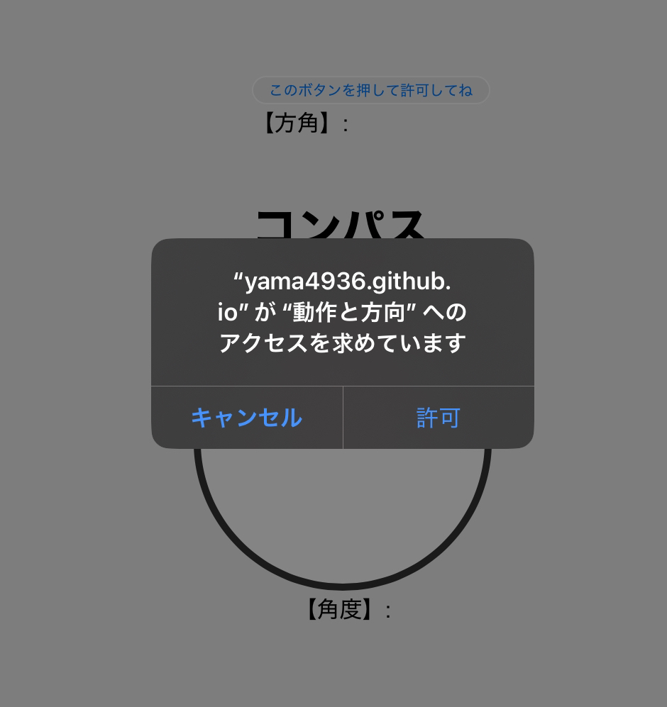

# コンパス Webアプリケーション

JSとセンサー系の練習としてコンパスのwebアプリをつくりました

## 概要

- 方角と角度がWebで分かる
- いつでもインターネットさえ繋がっていれば方角を知ることが出来る

## 使用方法

### Webサイトで閲覧

https://yama4936.github.io/compass
を開く

### 実行方法
~~~
git clone https://github.com/yama4936/compass.git
~~~

自分の端末でhttpsのサーバーを立ち上げてスマホからアクセスしてください

iPhoneでは、httpの環境ではセンサーの許可を出せないので

## 実行方法の例

### ios13以降の場合

このような確認が出るので許可

### android または ios13以前の場合

特に確認なしで使える

## ライセンス

このプロジェクトはMITライセンスのもとで公開されています。

